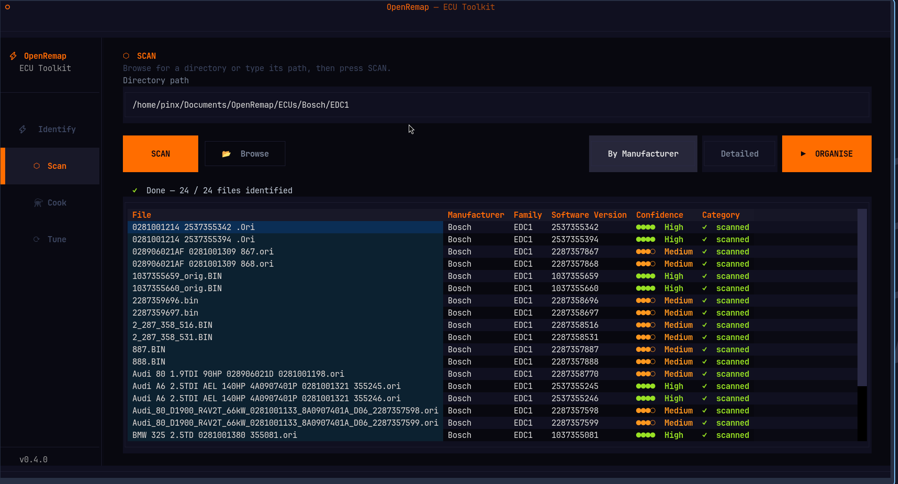

# OpenRemap

[](https://github.com/Pinelo92/openremap/actions/workflows/ci.yml)
[](https://codecov.io/gh/Pinelo92/openremap)
[](https://pypi.org/project/openremap/)
[](CHANGELOG.md)
[](LICENSE)
[](https://www.python.org/downloads/)
[](https://github.com/astral-sh/uv)

> **Runs on your machine. No internet. No account. No data leaves your hands — ever.**

Drop a `.bin`, know exactly what it is. Triage a folder of hundreds. Apply a tune you can read in any text editor.

<p align="center">
  
</p>

---

## What it does

- **Identify** — manufacturer, ECU family, software version, hardware number, and a confidence verdict. Under a second.
- **Scan & organise** — point at a folder of mixed binaries and sort them into `Bosch/EDC17/`, `Bosch/ME7/`, etc. in one click. Every file classified and confidence-tagged.
- **Cook** — diff a stock and modified binary into a portable JSON recipe. Every changed byte, readable in Notepad.
- **Tune** — validate, patch, and verify in one shot. Full audit trail baked in.
- **Confidence scoring** — `HIGH`, `MEDIUM`, `LOW`, `SUSPICIOUS`, or `UNKNOWN` — based on signals read straight from the binary. Modified files are flagged before you touch anything.

17 Bosch ECU families supported — from 8 KB LH-Jetronic ROMs (1982) to 8 MB EDC17 flash dumps. → [Full family reference](docs/manufacturers/bosch.md)

→ [How it all works in detail](docs/about.md)

---

## Install

- 🪟 **Windows** — [Step-by-step guide](docs/install/windows.md) · written for people who rarely use a terminal
- 🍎 **macOS / 🐧 Linux** — [One-command install](docs/install/macos-linux.md)
- 🛠️ **Contributing / development** — [Clone and run from source](docs/install/developers.md)

---

## Get started

```bash
openremap
```

That's it. The full terminal UI launches — identify files, scan folders, cook recipes, and apply tunes, all from one interface. No flags to memorise.

The complete CLI is still there when you need it:

```bash
openremap workflow    # Prints a plain-English guide with every step and command
openremap commands    # Quick reference for all available commands
```

→ [Full CLI reference](docs/cli.md)

---

## Documentation

- [CLI commands overview](docs/cli.md)
- [Confidence scoring — tiers, signals, and breakdown](docs/confidence.md)
- [Supported Bosch ECU families](docs/manufacturers/bosch.md)
- [Recipe JSON format](docs/recipe-format.md)
- [Contributing — adding extractors, code style, PRs](CONTRIBUTING.md)

---

## Contributing

Contributions are welcome — especially new ECU family extractors. See [CONTRIBUTING.md](CONTRIBUTING.md).

## License

MIT — see [LICENSE](LICENSE).

---

> ⚠️ **Checksum verification is mandatory.** Before flashing any tuned binary to a vehicle, you **must** run it through a dedicated checksum correction tool (ECM Titanium, WinOLS, or equivalent). `openremap tune` confirms the recipe was applied correctly — it does **not** correct or validate ECU checksums. Flashing a binary with an incorrect checksum **will brick your ECU.**

> ⚠️ **Research and educational use only.** Any output produced by this software must be reviewed by a qualified professional before being flashed to a vehicle. The authors accept no liability for damage, loss, or legal consequences arising from its use. Read the full [DISCLAIMER](DISCLAIMER.md).
